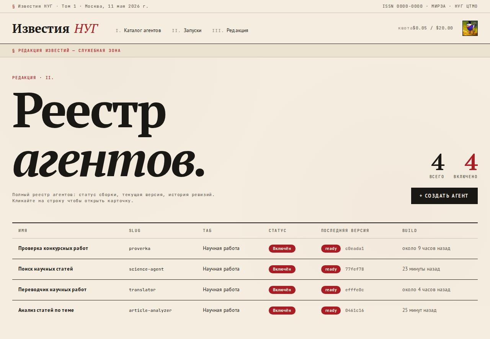
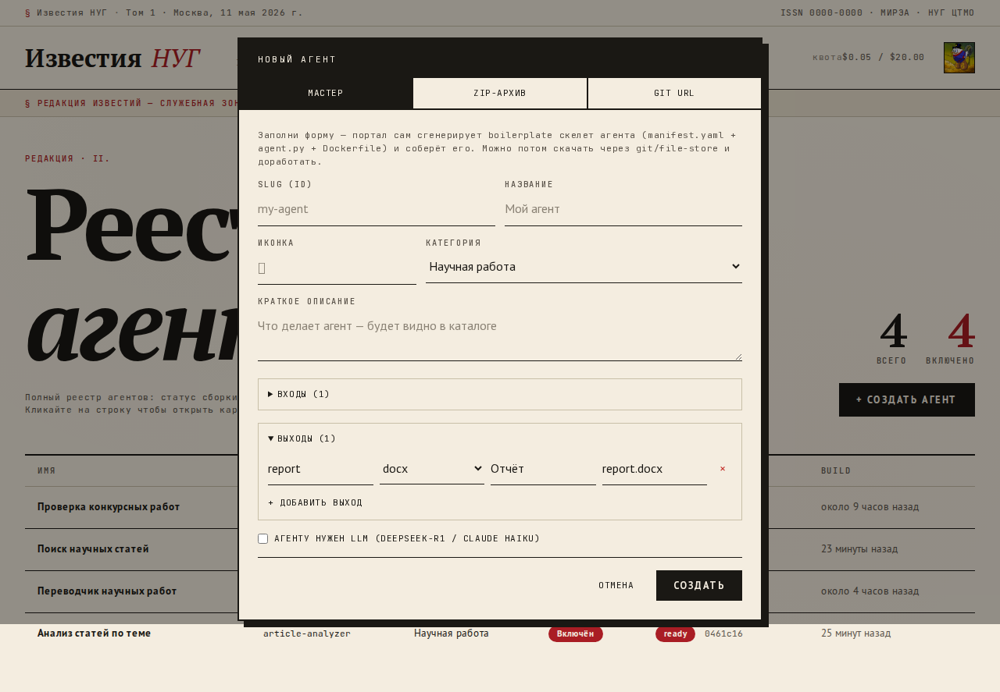
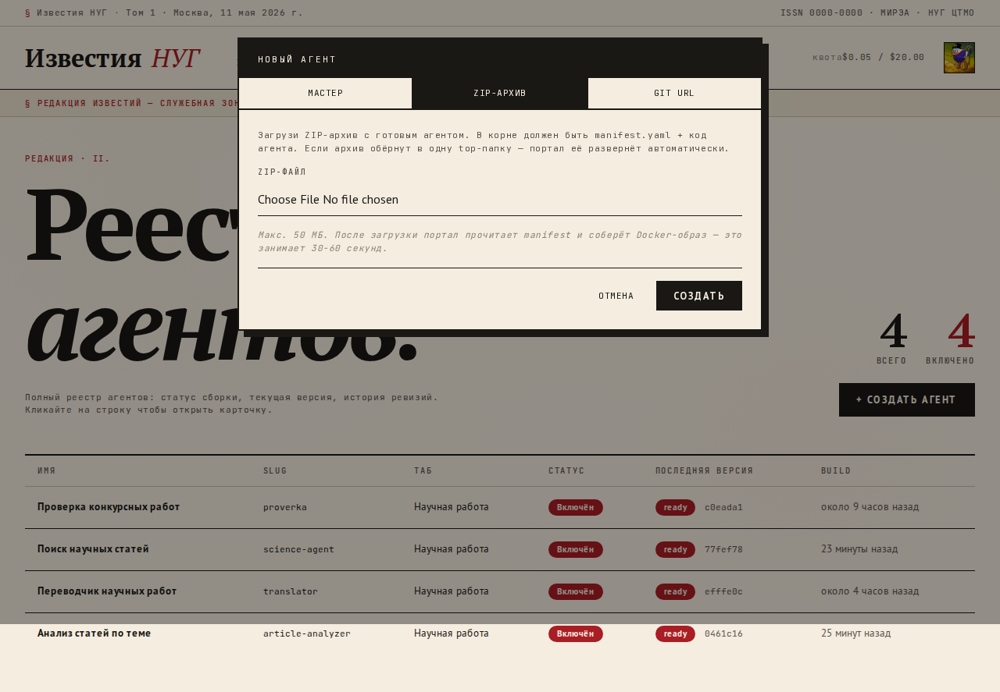

# Гид администратора кафедры

Этот документ — для администратора НУГ, который хочет добавить нового AI-агента в портал. Программирование не требуется.

> Полная документация для разработчиков агентов: [`docs/agent-developer-guide.md`](agent-developer-guide.md).

---

## Содержание

1. [Что такое агент в портале](#что-такое-агент-в-портале)
2. [Каталог агентов](#каталог-агентов)
3. [Способ A: Мастер (рекомендуется)](#способ-a-мастер-рекомендуется)
4. [Способ B: Загрузка ZIP-архива](#способ-b-загрузка-zip-архива)
5. [Способ C: Git URL (для опытных)](#способ-c-git-url-для-опытных)
6. [Управление версиями](#управление-версиями)
7. [Квоты и лимиты](#квоты-и-лимиты)

---

## Что такое агент в портале

Агент — это **отдельная программа** (контейнер Docker), которая принимает параметры от пользователя, обрабатывает их и возвращает файлы.

Примеры готовых агентов:
- **Проверка конкурсных работ** — папка PDF/DOCX → Word-отчёт со сводной оценкой.
- **Поиск научных статей** — тема исследования → ранжированный список статей в arXiv.
- **Анализ статей по теме** — папка PDF + тема → разбор каждой статьи.
- **Переводчик научных работ** — DOCX или текст → перевод на нужный язык.

Каждый агент имеет:
- **slug** — короткий идентификатор (`science-agent`, `proverka`).
- **manifest.yaml** — описание входов и выходов.
- **Docker-образ** — собирается автоматически порталом.

---

## Каталог агентов

Все агенты живут в `/admin/agents`:



Можно:
- 👁 видеть статус сборки каждой версии,
- ✅ включать/выключать агента в публичном каталоге,
- 💰 ставить лимит стоимости запуска (per_agent_cost_cap),
- 🗑 удалять.

---

## Способ A: Мастер (рекомендуется)

**Когда использовать:** ты не программист, но знаешь что должен делать агент.

1. На `/admin/agents` нажми **+ Создать агент**.
2. В диалоге выбери вкладку **МАСТЕР** (открыта по умолчанию).
3. Заполни форму:



| Поле | Что писать |
|---|---|
| **Slug (id)** | Короткое уникальное имя строчными буквами, например `my-agent` |
| **Название** | Видимое в каталоге, например `Мой агент` |
| **Иконка** | Эмодзи 1 символ (опционально), например `📊` |
| **Категория** | Научная / Учебная / Организационная |
| **Краткое описание** | 1-3 предложения, что делает агент |
| **Входы** | Какие параметры собрать у пользователя (text, textarea, number, checkbox) |
| **Выходы** | Какие файлы выдаст агент (docx, pdf, json, txt) |
| **Использовать LLM** | Если агент должен использовать DeepSeek/Claude |

4. Нажми **СОЗДАТЬ**.

**Что произойдёт:**
- Портал сгенерирует скелет агента (`manifest.yaml`, `agent.py`, `Dockerfile`).
- Соберёт Docker-образ (около 30-60 секунд).
- Когда статус станет `ready` — нажми «Включить» и агент появится в каталоге.

**Важно:** мастер создаёт **скелет**. Бизнес-логику нужно дописать в `agent.py`. Чтобы скачать сгенерированный код, обратись к разработчику — он возьмёт его из портала по slug.

---

## Способ B: Загрузка ZIP-архива

**Когда использовать:** у тебя есть готовый код агента (от студента-разработчика), но нет GitHub.

1. На `/admin/agents` нажми **+ Создать агент**.
2. Выбери вкладку **ZIP-АРХИВ**.



3. Выбери `.zip` файл с агентом.

**Что должно быть внутри ZIP:**

```
my-agent/
├── manifest.yaml       ← обязательный
├── agent.py
├── requirements.txt
└── Dockerfile
```

Или плоско (без `my-agent/` обёртки):
```
manifest.yaml
agent.py
requirements.txt
Dockerfile
```

Лимит: **50 МБ**.

4. Нажми **СОЗДАТЬ**.

Портал извлечёт архив, прочитает манифест, соберёт образ.

---

## Способ C: Git URL (для опытных)

**Когда использовать:** агент уже лежит на GitHub.

1. **+ Создать агент** → вкладка **GIT URL**.
2. Введи `https://github.com/...` (репо должен быть **публичным**).
3. Укажи ветку/тэг/SHA (по умолчанию `main`).

Удобно для итеративной разработки: push в GitHub → создаёшь новую версию в админке → портал клонирует и собирает.

---

## Управление версиями

У каждого агента может быть **несколько версий**. Только одна — `current`, она доступна пользователям.

В админке:
- Кликни на агента в списке → откроется drawer со всеми версиями.
- Нажми «Создать новую» → введи git_ref → портал заберёт новый коммит.
- После build `ready` → «Сделать текущей» (set current).

Старые версии не удаляются — можно откатиться кликом.

---

## Квоты и лимиты

### Per-user (на пользователя)

В `/admin/users` → клик на юзера:

| Поле | Описание |
|---|---|
| **Месячный лимит, USD** | Сколько $ юзер может потратить на LLM за календарный месяц |
| **Лимит на задачу, USD** | Сколько $ максимум на один запуск любого агента |

«Сбросить period_used» — обнуляет потраченное в текущем месяце (для тестов).

### Per-agent (на конкретного агента)

В `/admin/agents` → drawer → поле **«лимит, $»**:

Если задан — никто (даже админ) не может потратить больше этой суммы за один запуск этого агента. Если пусто — действует только per-user лимит.

Полезно для **дорогих** агентов: например, статья-анализатор на DeepSeek-R1 может стоить $0.20 за документ — поставь cap $1, чтобы случайно не потратить много.

---

## Полезные ссылки

- **Каталог агентов**: `/agents` (публичный, после входа)
- **Управление вкладками**: `/admin/tabs`
- **Запуски всех юзеров**: `/admin/jobs`
- **Журнал аудита**: `/admin/audit`
- **Использование LLM**: `/admin/usage`
- **Расписания (cron)**: `/admin/crons`

---

## Если что-то не работает

| Симптом | Что делать |
|---|---|
| ZIP отклонён `MISSING_MANIFEST` | В корне архива нет `manifest.yaml` |
| ZIP отклонён `UNSAFE_PATH` | В архиве есть `../` или абсолютные пути |
| ZIP отклонён `ZIP_TOO_LARGE` | Превышен лимит 50 МБ |
| Билд завис в `building` >5 мин | Зайди в `/admin/jobs` или попроси разработчика глянуть worker-логи |
| Билд `failed` | Кликни на версию → увидишь `build_error` (обычно — ошибка в Dockerfile или зависимостях) |
| Манифест валиден, но билд `failed` | Проверь `requirements.txt` — все ли пакеты ставятся на python:3.12-slim |
| Юзер видит 402 при запуске | Превышена per-job квота или per-agent cap |

Дальше — к разработчику или в [`docs/agent-developer-guide.md`](agent-developer-guide.md).
